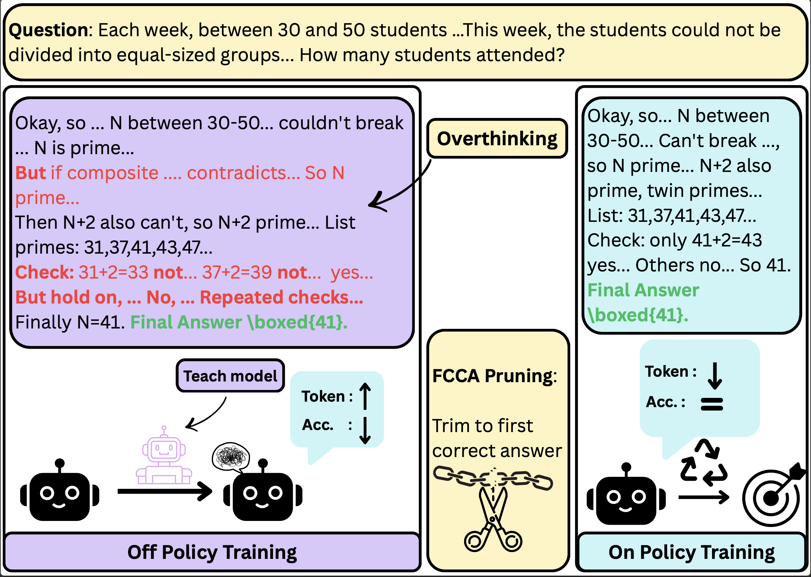
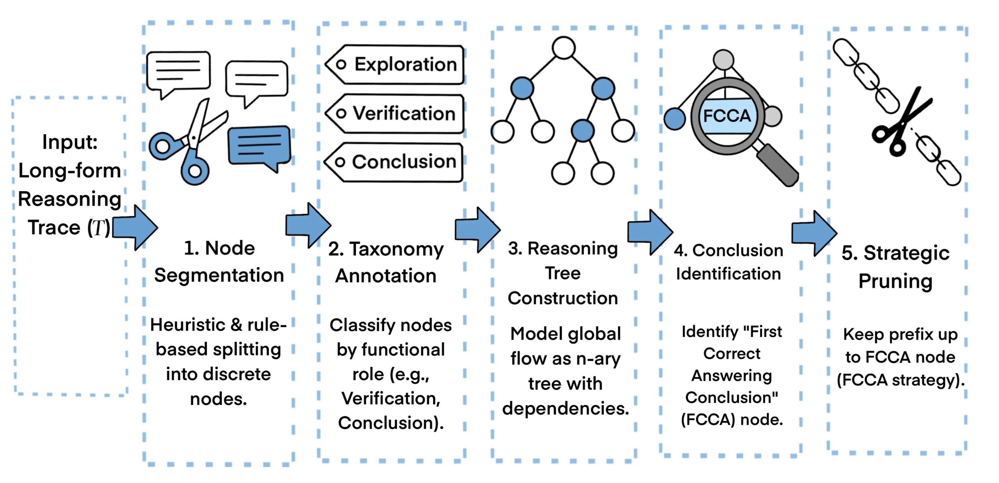

# From Traces to Trees: Structured On-Policy Pruning of Long-Form Reasoning in Reasoning Language  Models

Official implementation of FCCA-Pruning:  
Structured Chain-of-Thought Pruning for Efficient Reasoning in Large Language Models


---

# 📚 Overview
- 🎉 [News](#news)  
- 📖 [Introduction](#introduction)  
- ✨ [Getting Started](#getting-started)  
- 🔧 [Usage(Core)](#usage)  
- 📃 [Evaluation](#evaluation)  
- 🎈 [Citation](#citation)  
- 🌻 [Acknowledgement](#acknowledgement)  
<!-- - 📈 [Star History](#star-history) -->


---

# 🎉News
- **[2026/01/20]** FCCA paper available on [arXiv](link). 


# 📖Introduction

FCCA-Pruning is a structured chain-of-thought pruning method that retains only the minimal prefix up to the first correct conclusion, removing all redundant post-solution reasoning steps. This significantly reduces inference costs, mitigates overthinking behavior, and preserves semantic coherence and task performance.



## Key Features

- Minimal prefix structured pruning (FCCA)
- Built on ModelScope + Swift ecosystem
- Standardized evaluation with EvalScope
- Reproducible pruning and evaluation pipelines

## Repository Structure

```
Main
.
├── pruned_data_pipeline/ 
│   ├── data/
│   │   ├── batch_requests_taxonomy
│   │   ├── batch_requests_conclusion
│   │   └── prm12k.csv                #Raw data start from here
│   ├──  prm12k_self_distill.ipynb    #FCCA  Step 1
│   ├──  google_batch_api.ipynb       #FCCA  Step 2
│   └──  prm12k_tree_pruning.ipynb    #FCCA  Step 3
├── inference/                        #Inference for self-distill response generation and answer checking
│   ├── inference.py                    
│   └── best_of_N_inference.py
├── training/
│   ├── export_model.sh                 #Merge Adaptor
│   ├── run.sh                          #Use this script to run. 
│   └── train.sh                        #Training hyperparameters
├── eval/
│   └── auto_eval.py
├── outputs/
├── figs/
└── README.md
```
# ✨Getting Started

1. Environment Setup (Recommended)

```
conda create -n fcca python=3.10 -y
conda activate fcca
pip install modelscope "modelscope-swift[llm]" evalscope vllm transformers
```

2. Use Our On Policy FCCA PRM 12k data to train FCCA model
```
./train/run.sh
```

3. Evaluate the Pruned Model
```
python ./eval/auto_evalscope.py
```

## Main Experimental Settings
```
Base Models: DeepSeek-R1-Distill-Qwen-7B, DeepSeek-R1-Distill-llama-8B
Datasets: PRM 12k (1000 selected)
Training Lengths:  4096 / 8192
Random Seeds: 1
Decoding Strategy: top-p (0.95)
```

## Evaluation Benchmarks

```Math500,      GSM8K,         AIME 2024```

# 🔧Usage(Core)
First, we use ```prm12k_self_distill.ipynb``` to generate four self-distilled datasets. From these, we select responses with medium-length reasoning and correct answers to construct a best-seed dataset. This step requires GPU-based inference, for which we provide the script ```best_of_N_inference.sh``` and```inference.sh```.

Next, the resulting dataset is fed into ```prm12k_tree_pruning.ipynb``` to perform FCCA pruning. During this process, google_batch_api.ipynb is used twice for batch inference. The detailed execution steps and intermediate handling are documented within ```prm12k_tree_pruning.ipynb``` and should be followed accordingly.



# 🌻Acknowledgement

FCCA builds upon [swift](https://github.com/modelscope/ms-swift) and utilizes [vLLM](https://github.com/vllm-project/vllm) for inference. We utilize [evalscope](https://github.com/modelscope/evalscope) for evaluation. We thank the open-source community for datasets and backbones, including [PRM 12k](https://huggingface.co/datasets/horseee/MixChain-Z-PRM12K) and [DeepSeek-R1](https://github.com/deepseek-ai/deepseek-r1) model series. 


## Citation

@article{xu2026fcca,
  title     = {FCCA-Pruning: Structured Chain-of-Thought Pruning for Efficient Reasoning in Large Language Models},
  author    = {Xu, Chenjun and ...},
  journal   = {arXiv preprint arXiv:XXXX.XXXXX},
  year      = {2026}
}


Happy experimenting!
