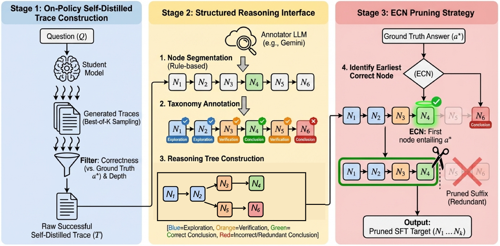

# STOP: Structured On-Policy Pruning of Long-Form Reasoning in Low-Data Regimes

Official implementation of STOP.

## Overview

- [News](#news)
- [Introduction](#introduction)
- [Getting Started](#getting-started)
- [Usage](#usage)
- [Evaluation](#evaluation)
- [Acknowledgement](#acknowledgement)
- [Citation](#citation)

## News

- COLM 2026 

## Introduction

STOP is an on-policy framework for pruning long-form reasoning traces in low-data regimes. It combines:

- self-distilled trace construction from the student model,
- a structured reasoning interface built with node segmentation, taxonomy annotation, and reasoning-tree construction,
- ECN pruning, which keeps the minimal prefix up to the earliest correct answering conclusion while preserving semantic continuity.

Across DeepSeek-R1-Distill-Qwen-7B and DeepSeek-R1-Distill-LLaMA-3-8B on GSM8K, Math 500, and AIME 2024, the paper reports 19.4% to 42.4% token reduction while largely preserving accuracy.



## Key Features

- STOP framework for structured on-policy pruning
- ECN node-level pruning on top of a structured reasoning interface
- On-policy self-distilled supervision for low-data fine-tuning
- Reproducible training and evaluation based on Swift, vLLM, and EvalScope

## Repository Structure

```text
.
├── pruned_data_pipeline/
│   ├── data/
│   │   └── prm12k.csv
│   ├── prm12k_self_distill.ipynb      # STOP stage 1: self-distilled trace construction
│   ├── google_batch_api.ipynb         # Annotation / batch API utilities
│   ├── prm12k_tree_pruning.ipynb      # STOP stage 2-3: structured interface + ECN pruning
│   ├── best_of_N_inference.sh         # Best-of-K sampling for trace generation
│   └── inference.sh                   # Single-run inference / checking
├── train/
│   ├── run.sh
│   ├── train.sh
│   ├── export_model.sh
│   └── train_and_benchmark_all.sh
├── eval/
│   ├── auto_eval.py
│   └── report.py
├── pipeline/
│   ├── prepare_prompts.py
│   ├── build_judge_prompts.py
│   ├── select_good_traces.py
│   ├── segment_traces.py
│   ├── build_annotation_batches.py
│   ├── collect_annotations.py
│   ├── prune_ecn.py
│   └── validate_artifacts.py
├── scripts/
│   ├── check.sh
│   └── common.sh
├── configs/
│   └── default.env.example
├── docs/
│   └── pipeline.md
├── figures/
├── requirements.txt
└── README.md
```

## Getting Started

1. Environment setup

```bash
conda create -n stop python=3.10 -y
conda activate stop
pip install -r requirements.txt
```

2. Train with STOP / ECN-constructed data

```bash
./train/run.sh
```

The default training entry expects `./data/ecn_self_distill_qwen.jsonl`.
You can override the main paths without editing the script:

```bash
MODEL="deepseek-ai/DeepSeek-R1-Distill-Qwen-7B" \
DATASET_DIR="./data" \
OUTPUT_BASE_DIR="./train/model" \
./train/run.sh
```

For the full step-by-step workflow, see [`docs/pipeline.md`](./docs/pipeline.md).

3. Evaluate the pruned model

```bash
python3 ./eval/auto_eval.py \
  --model "./train/model/example/checkpoint-100-merged=stop_qwen" \
  --datasets math_500
```

## Main Experimental Settings

```text
Base model: DeepSeek-R1-Distill-Qwen-7B
Training dataset: ./data/ecn_self_distill_qwen.jsonl
Train type: LoRA
Torch dtype: bfloat16
Maximum training length: 8192
Random seed: 1
Per-device train / eval batch size: 1 / 1
Gradient accumulation steps: 16
Learning rate: 1e-4
LoRA rank / alpha: 8 / 32
Target modules: all-linear
Warmup ratio: 0.05
Training epochs: 6
Eval / save / logging steps: 100 / 100 / 5
Save total limit: 2
Dataloader workers: 4
Default GPU: CUDA_VISIBLE_DEVICES=0, overridable from the environment
```

## Evaluation

Benchmarks:

```text
Math500, GSM8K, AIME 2024
```

## Usage

1. Use `prm12k_self_distill.ipynb` together with `best_of_N_inference.sh` and `inference.sh` to generate self-distilled traces and keep successful candidates.
2. Use `google_batch_api.ipynb` and `prm12k_tree_pruning.ipynb` to build the STOP structured reasoning interface, identify the ECN for each trace, and prune each trace to its minimal correct prefix.
3. Fine-tune the student model on the resulting ECN-pruned supervision targets with `./train/run.sh`.
4. Run `python3 ./eval/auto_eval.py` for benchmark evaluation.

Useful script examples:

```bash
./pruned_data_pipeline/best_of_N_inference.sh \
  -m "deepseek-ai/DeepSeek-R1-Distill-Qwen-7B" \
  -d "./data/self_distill_prompts.jsonl" \
  -o "./best_of_n_results/qwen" \
  -s 1,2,3,4

python3 ./eval/report.py ./outputs --output-csv ./outputs/summary.csv
```

Run lightweight checks before committing:

```bash
./scripts/check.sh
```

## Acknowledgement

STOP builds upon [swift](https://github.com/modelscope/ms-swift) and uses [vLLM](https://github.com/vllm-project/vllm) for inference. We use [EvalScope](https://github.com/modelscope/evalscope) for evaluation. We thank the open-source community for datasets and backbones, including [PRM 12k](https://huggingface.co/datasets/horseee/MixChain-Z-PRM12K) and the [DeepSeek-R1](https://github.com/deepseek-ai/deepseek-r1) model series.

## Citation

Citation information will be updated after the paper release.
